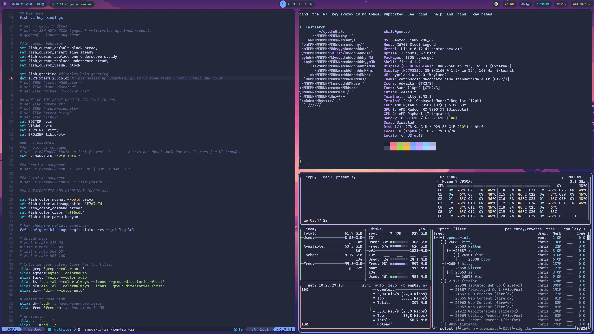

# Dotfiles

These are all my config files. There are two branches; master and gentoo. Master is for my arch machine and gentoo is for my gentoo machine. They're mostly the same, but if you're not a gentoo user then I recommend you pull from the master branch instead.  

## What I use

I use Dwm, fish shell, neovim and most of suckless' tools. Dwm might be the easiest window manager to configure, you don't need to know any C at all. They're a few videos on YouTube on how to patch it, and once you're done, you never have to tweak it again. There's a `patches` directory with a list of all the patches. 

The zsh config I took from [Chris the machine.](https://github.com/ChristianChiarulli) 

A lot of my stuff I've forked or borrowed from [Luke Smith.](https://github.com/LukeSmithxyz) You'll find I have his:

- Scripts for a lot of useful stuff
- Fork of st
- Lf settings 
- Sxiv settings
- [mutt-wizard](https://github.com/lukesmithxyz/mutt-wizard)

You'll notice that my file structure looks different. That's because I'm using GNU stow. Here's a video from [Chris the machine](https://www.youtube.com/watch?v=90xMTKml9O0&t=64s) explaining how to use it. He's also the main developer for [lunarvim.](https://www.lunarvim.org/)

## Installing 

Download `stow` and `git`.

Clone into your `$HOME` directory or `~`.

You'll also need a [nerd font](https://github.com/ryanoasis/nerd-fonts) to view icons with my set up. 

``````
git clone https://github.com/cmpi66/dotfiles.git ~
``````
Run `stow` to symlink everything or select any config files you want. 

``````bash
stow */ # this gets everything; the '/' ignores the README
``````
``````bash
stow fish # Only my fish config
``````
